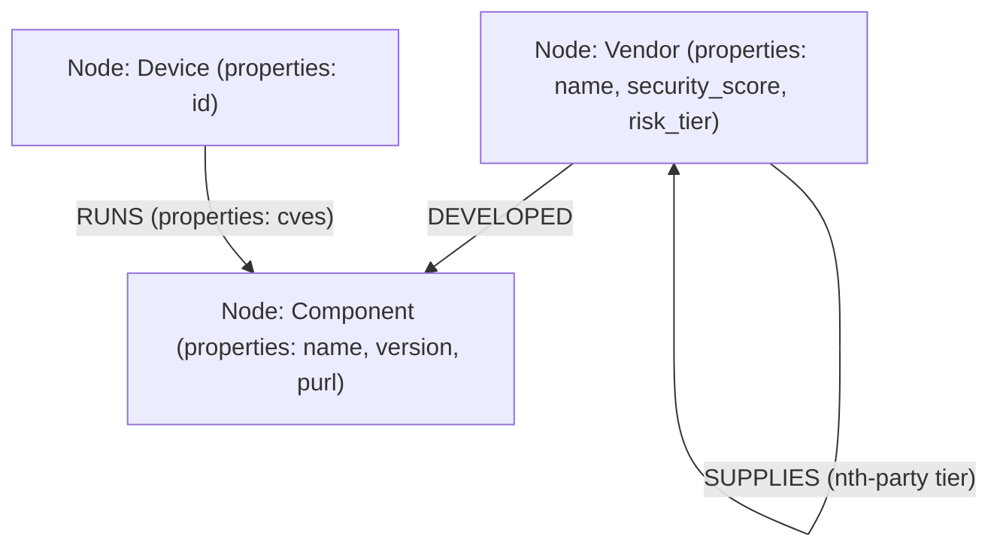

# Decentralized Agentic Risk Intelligence Fabric (DARIP)
## Core Architectural Specification

The **Decentralized Agentic Risk Intelligence Fabric (DARIP)** is a next-generation cyber risk management and supply-chain resilience platform. Rather than managing third-party risks through static vendor questionnaires and periodic assessment cycles, DARIP models the entire corporate supply chain as a **dynamic, evolving knowledge graph** and orchestrates automated, multi-agent AI processes to identify, evaluate, and remediate risk in real time.

---

## 1. Dynamic Knowledge Graph Paradigm

Traditional Third-Party Risk Management (TPRM) relies on rigid databases representing vendor profiles. DARIP treats the supply chain as a graph substrate, capturing deep 4th-party, $n\text{-th}$ party, and transitively inherited dependencies.

### Graph Schema
The fabric represents the supply chain ecosystem through three principal node classes and their associated relationships:



- **Nodes**:
  - **Vendor (`:Vendor`)**: Represents organizations supplying software, hardware, or services. Attributes include `name`, `security_score` (0-100), and calculated `risk_tier` (LOW, MEDIUM, HIGH, CRITICAL).
  - **Component (`:Component`)**: Represents specific software libraries, dependencies, packages, or hardware units. Key attributes are `name`, `version`, and `purl` (Package URL, e.g., `pkg:generic/openssl@1.1.1t`).
  - **Device (`:Device`)**: Represents internal enterprise hosts, cloud instances, or endpoint machines reported via internal telemetry. Identified by `id`.
- **Relationships**:
  - **`SUPPLIES`**: Directed edge from one Vendor to another (e.g., `[Vendor: Acme] -[:SUPPLIES]-> [Vendor: BetaCorp]`), representing n-th party dependency.
  - **`DEVELOPED`**: Links a Vendor to a Component they construct or maintain.
  - **`RUNS`**: Connects a Device to an installed Component. This edge carries a list property `cves` containing active CVE identifiers detected on that device.

This graph-based modeling enables deep transitive search, permitting the fabric to trace how a critical vulnerability in a 4th-party library propagates upward to compromise critical internal assets.

---

## 2. Five-Layer Microservices Architecture

DARIP is built on a highly modular, five-layered microservice architecture. Each layer is containerized and runs independently.

```
       [ External Signals: SBOMs, Ratings, Host Telemetry ]
                                |
+-------------------------------+-----------------------------------+
| 1. DATA INGESTION SERVICE     | Normalizes signals, encapsulates  |
| (Port 8000)                   | Kyber secrets, encrypts payload   |
+-------------------------------+-----------------------------------+
                                | Secure PQC Tunnel (Kyber/AES-GCM)
                                v
+-------------------------------+-----------------------------------+
| 2. SEMANTIC FUSION SERVICE    | Decapsulates secret, decrypts data|
| (Port 8002)                   | Writes to Stateful Graph (Neo4j)  |
+-------------------------------+-----------------------------------+
         ^                      |                     |
         |                      | Subgraph            | Traversal
         |                      v                     v
+--------+----------------------+---------------------+-------------+
| 5. GOVERNANCE SERVICE         | 3. PREDICTIVE INFERENCE SERVICE   |
| (Port 8001)                   | (Port 8003)                       |
| Zero-Trust Token Issuer &     | Stateless risk modeling on sub-   |
| Rego OPA Policy Evaluator     | graphs (Autoscaled pods)          |
+--------+----------------------+---------------------+-------------+
         ^                                            |
         | Zero-Trust Checks                          v Risk Index
         |                                            | & Level
+--------+--------------------------------------------+--------------+
| 4. AGENTIC EXECUTION SERVICE (Port 8004)                          |
| Autonomous Multi-Agent Orchestrator:                              |
|   - Discovery Agent -> Maps dependencies & SBOMs                  |
|   - Risk Evaluator Agent -> Triggers inference & cascading risks   |
|   - Remediation Agent -> Recommends patches & issues alerts       |
+-------------------------------------------------------------------+
```

### Layer 1: Data Ingestion
- **Service Name**: `data-ingestion-service` (Port 8000)
- **Role**: Serves as the entry point for external signals (CycloneDX SBOMs, third-party security ratings) and internal signals (device vulnerability scans).
- **Execution Flow**:
  1. Receives multi-signal payloads from webhooks, CI/CD pipelines, or telemetry agents.
  2. Normalizes signals into structured formats.
  3. Establishes a post-quantum cryptographic (PQC) secure tunnel with the Semantic Fusion service. It requests the Fusion service's Kyber public key, encapsulates a symmetric shared secret, encrypts the payload via AES-GCM, and forwards the ciphertext with the encapsulated KEM envelope.

### Layer 2: Semantic Fusion
- **Service Name**: `semantic-fusion-service` (Port 8002)
- **Role**: The custodian of the supply chain knowledge graph. It handles stateful mutations and data persistence.
- **Execution Flow**:
  1. Decapsulates incoming Kyber KEM envelopes to recover the shared secret, then decrypts the payload.
  2. Submits inter-service authorization requests to the Governance Service.
  3. Fuses data into the graph. It links newly discovered devices to software components and registers dependency connections between vendors.
  4. Exposes REST endpoints to return localized vendor subgraphs for risk calculations.

### Layer 3: Predictive Inference
- **Service Name**: `predictive-inference-service` (Port 8003)
- **Role**: Stateless computation engine that assesses risk indices across the dependency topology.
- **Scalability Principle**: Stateless pods are decoupled from the stateful Neo4j store. By running in the public cloud while the graph remains in the sovereign cloud, this foundational design enables 10x scalability without choking database transactions or risking data exposure. When evaluating a vendor's risk, the service requests the vendor's subgraph from the Semantic Fusion service and runs calculations in memory.
- **Risk Propagation Model**: Evaluates risk by traversing the topology to calculate:
  - **Composite Risk Score**: An index (0-100) combining downstream vendor safety ratings, the depth of the dependency chain, and the count of active vulnerabilities.
  - **Vulnerability Cascade Probability**: The likelihood of a library compromise propagating across the network (e.g., $P(\text{cascade}) = f(\text{vendor\_count}, \text{active\_cves})$).
  - **Contributing Factors**: NLP-friendly explanations of risk drivers.

### Layer 4: Agentic Execution
- **Service Name**: `agentic-execution-service` (Port 8004)
- **Role**: Orchestrates autonomous agents executing workflows for threat assessment and automated mitigation.
- **Agent Roles**:
  - **Discovery Agent**: Inspects ingested SBOMs, queries external registries, and maps fourth- and n-th-party supply links.
  - **Risk Evaluator Agent**: Triggers predictive inference on the resolved subgraph and checks risk levels against corporate acceptance thresholds.
  - **Remediation Agent**: Formulates mitigation actions, such as drafting library upgrade instructions (e.g., patching OpenSSL 1.1.1t to 3.0.x) or raising automated quarantine requests in SecOps ticketing tools.

### Layer 5: Governance
- **Service Name**: `governance-service` (Port 8001)
- **Role**: The centralized trust and security anchor of the fabric. Enforces Zero-Trust token issuance and verifies policy compliance in real time.
- **Features**:
  - Generates token claims wrapped in post-quantum signatures.
  - Acts as the Policy Decision Point (PDP) for inter-service communications and agent task executions, checking claims against predefined OPA Rego policies.

---

## 3. Post-Quantum Cryptography & Zero-Trust Security

DARIP implements security natively, protecting the risk fabric from interception and unauthorized execution.

### Post-Quantum Cryptographic Fabric
All inter-component communications utilize post-quantum cryptographic primitives (with simulated fallback configurations if the system lacks the native C-based `liboqs` library):
- **Digital Signatures (Dilithium3)**: Used by the Governance Service to sign access tokens. Every token contains standard JWT payloads signed with Dilithium3 private keys, preventing token forgery.
- **Key Encapsulation Mechanism (Kyber768)**: Used to establish secure ephemeral symmetric channels. The Semantic Fusion service publishes its Kyber public key. When sending data, the Ingestion service generates a random shared key, encrypts it using Kyber, and attaches the ciphertext to the message.
- **Symmetric Encryption (AES-GCM-256)**: Once Kyber establishes the shared secret, payloads are encrypted using AES-GCM to enforce confidentiality and integrity in transit.

### Policy-as-Code & Zero-Trust Verification
Every inter-service API call and agent execution must present a Governance-issued token. The target service forwards this token to the Governance Service for verification:
1. **PQC Signature Check**: Governance validates the token's Dilithium3 signature.
2. **OPA Rego Policy Enforcement**: Governance runs the request metadata through Open Policy Agent (OPA) rules (defined in `policies.rego`):
   - **Inter-service flows**: Allows `data_ingestion` to call `semantic_fusion`, but denies `data_ingestion` from calling the graph store directly.
   - **Agent tasks**: Authorizes specific tasks per agent (e.g., `discovery_agent` can execute `discover_vendor` and `read_sbom`, but is blocked from executing `trigger_remediation`).

---

## 4. Kubernetes and Istio Infrastructure Specification

The containerized service architecture is designed to run in a Kubernetes environment managed with an Istio service mesh and OPA Gatekeeper policies.

### Hybrid Cloud-Edge Deployment Model

DARIP natively supports a hybrid deployment topology to protect sensitive data while enabling elastic scale:
- **Sovereign Cloud / On-Premises (Edge)**: Stateful graph storage (Neo4j) and highly sensitive core computations—such as the Governance, Semantic Fusion, Data Ingestion, and Agentic Execution services—are anchored in a secure, sovereign environment.
- **Public Cloud (Scalable Inference)**: The stateless Predictive Inference pods are decoupled from the stateful layer and deployed into the public cloud. This separation permits rapid 10x scalability during sudden risk evaluation bursts without threatening the confidentiality of the core graph.
Node affinity and specific environment labels (`environment: sovereign-cloud` vs. `environment: public-cloud`) enforce this physical partitioning.

### Service Mesh (Istio) Integration
Istio enforces encryption and network isolation policies:
- **STRICT mTLS PeerAuthentication**: Configured namespace-wide, ensuring Kubernetes pods encrypt traffic using mutual TLS. Any unencrypted inter-pod traffic is rejected by Envoy sidecar proxies.
- **Istio AuthorizationPolicies**: Enforces service-level access control. These policies verify the identity of the calling pod based on its Kubernetes ServiceAccount name:
  - The database (`darip-graph-db`) only accepts connections from the `darip-semantic-fusion-sa` service account on the Bolt protocol port (7687).
  - The Semantic Fusion service (`darip-semantic-fusion`) only accepts `/fuse` POST requests from the `darip-data-ingestion-sa` service account, and `/subgraph/*` GET requests from the `darip-predictive-inference-sa` service account.
  - The Governance service (`darip-governance`) accepts token requests from all valid service accounts within the namespace.

### OPA Gatekeeper Constraints
Kubernetes clusters enforce security guidelines during pod admission:
- **Namespace Annotation Enforcement**: Rejects namespaces that do not request Istio proxy injection (`istio-injection: enabled`).
- **Registry Constraints**: Prevents deployments from running container images from unapproved registries. Only verified sovereign container registries (e.g., `registry.sovereign.local/` and local `darip/` tags) are permitted.

### Horizontal Scalability & Serverless Execution
Stateless microservices scale using a combination of Horizontal Pod Autoscalers (HPA) and Kubernetes Event-driven Autoscaling (KEDA).
- **HPA**: Core microservices (`semantic-fusion`, `agentic-execution`, `governance`) utilize standard HPA scaled based on CPU utilization metrics.
- **KEDA**: To handle sudden bursts of risk assessments without incurring baseline costs, the `darip-predictive-inference` service utilizes KEDA `ScaledObjects`. This permits the stateless inference engine to autoscale to zero during idle periods and massively scale up based on event queue lengths (e.g., Kafka lag) or custom metrics.

### Distributed Caching (Redis)
To optimize the high volume of sub-graph retrievals from the stateful Neo4j store, DARIP incorporates a distributed Redis cache cluster.
- **Query Caching**: `semantic-fusion` caches recently resolved graphs and risk indices. 
- **Ephemeral State**: Agents orchestrating complex workflows use Redis to store intermediate state across their executions, maintaining high availability for short-lived tasks.

### Multi-Region Active-Active Deployment
For disaster recovery and global high availability, DARIP employs a multi-region Active-Active deployment architecture managed via Kustomize overlays.
- **Region Overlays**: `region-us-east` and `region-eu-west` configurations apply regional labels, availability zones, and specific load-balancer integrations.
- **Global Traffic Routing**: In cloud environments, global endpoints route traffic to the nearest healthy region. The underlying Neo4j clusters are federated to sync critical risk state asynchronously across geographical boundaries.
